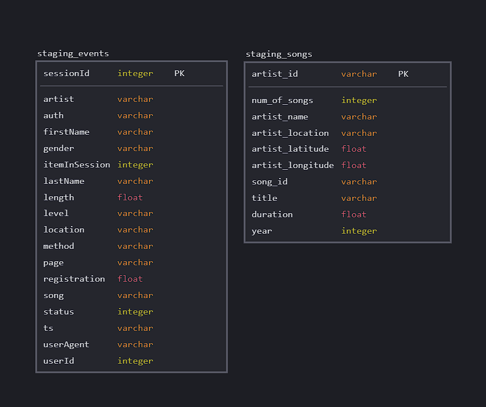
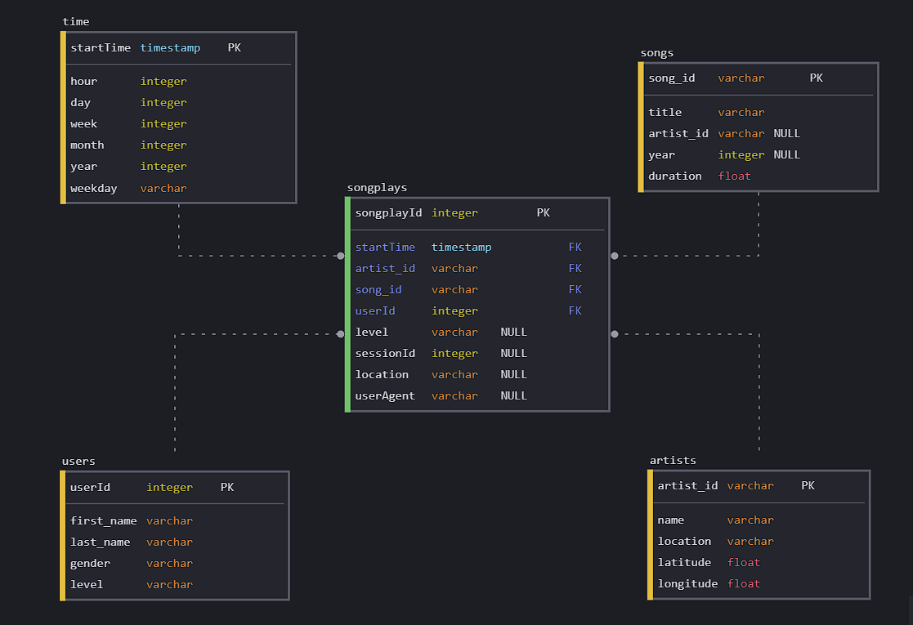

# About project

This project builds an ETL pipeline for the music streaming application Sparkify. Data will be extracted from an S3 bucket and staged in Redshift to be transformed into fact and dimension tables ultimately. 

## Files

+ `create_tables.py` : This file creates all the tables used within the project.
+ `etl.py`           : This file fills staging tables by copying data from S3 first and then fills fact and dimension tables using staging tables.
+ `sql_queries.py`   : Used by other files and contains all the queries used within the project. It includes drop, create, copy, insert and select queries.
+ `dwh.cfg`          : Contains redshift cluster configuration information as well as S3 links of song and log data.

## Staging tables

## Star Schema

## How to run

To run the project:

1. A redshift cluster with at least 1 dc2.large node, an IAM role with a read access and a VPC that allows all the traffic from outside in us-west-2 region must be created.
2. After creating cluster, 'CLUSTER' and 'IAM' sections of dwh.cfg file must be filled according to cluster information.
3. Finally, create_tables.py and etl.py can be run respectively.

## Author

[Arda Aras](https://www.linkedin.com/in/arda-aras/)
